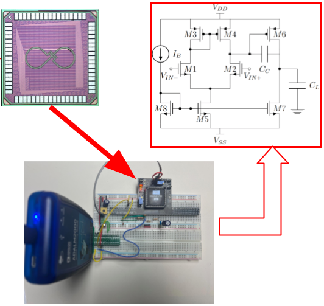

# Tools to Work with the MOSbius Chip.  

Detailed instructions are available from [MOSbius.org](https://mosbius.org).

## LTSpice
* Library to run simulations of circuits built with the MOSbius chip

## MOSbiusTools
* Tools to create bitstreams for the MOSbius chip
* Tools to process data files from Scopy and the ADALM2000

